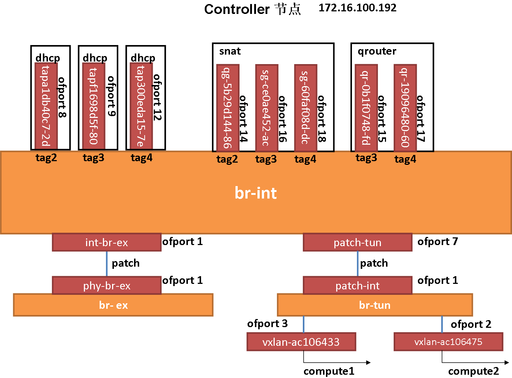

# Ovs agent br 以及 port 的创建

## 系统结构图如下

* 网络节点结构图

* 计算节点一结构图

* 计算节点二结构图

## 在各个网桥初始化时创建的连通彼此的 port

1. `setup_integration_br` 
 1. 创建 br-int
2. `setup_physical_bridges` 
 1. 创建 br-ex
 2. 创建 int-br-ex（br-int）
 3. 创建 phy-br-ex（br-ex） 
3. `setup_tunnel_br`
 1. 创建 br-tun
 2. 创建 patch-tun（br-int）
 3. 创建 patch-int（br-tun）

## 在支持 tunnel network 时，创建的 turnnel port

* 没有开启 l2pop 的情况下：
 1. 在收到 `tunnel_update` 的 RPC 调用时（Client：`TunnelAgentRpcApiMixin`；Server：`OVSNeutronAgent`），该方法会创建 tunnel port
 2. ovs 发生重启操作时会调用 `tunne_sync` 方法，该方法会创建 tunnel port

* 在启用了 l2pop 功能时：
 * 当收到 `add_fdb_entries` 的 RPC 调用时（Clinet：`L2populationAgentNotifyAPI`；Server：`OVSNeutronAgent`）

## 与 dhcp 服务有关的 port 的创建
 
* 每个 network 都会有一个 dhcp 服务，该 dhcp 服务刚启动（`DeviceManager.setup`）时会在一个单独的 namesapce 中创建 dhcp 监听的 port。

## 与路由有关的 port 的创建

由 l3 agent 创建

## 与虚拟机有关的 port 的创建

这些都是在 nova 中完成。

l2 agent 会监听 ovsdb Interface 数据库，用来获得网桥上 port 的变动。

* l2 agent 做的主要工作就是
 1. 网络的隔离
 2. 数据包的转发（flow 的设定）
